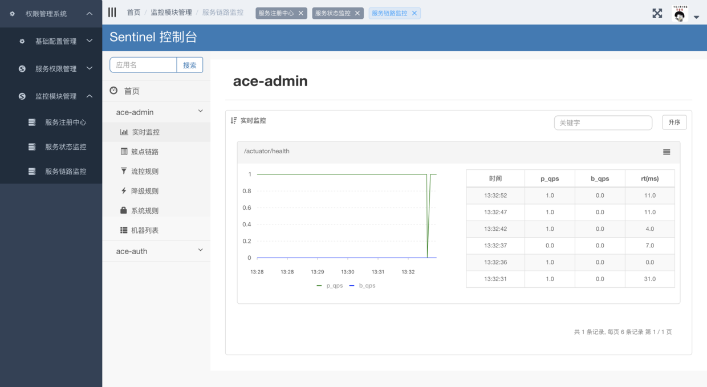
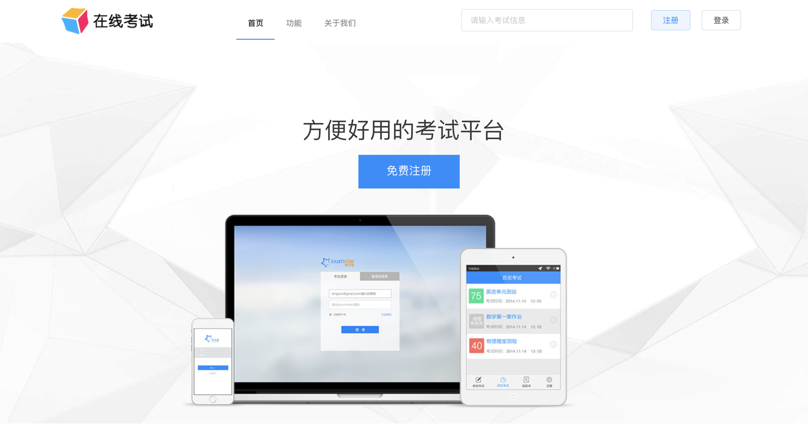
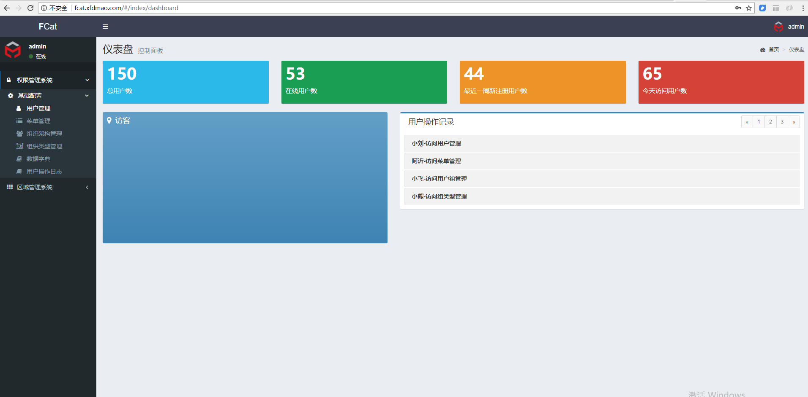
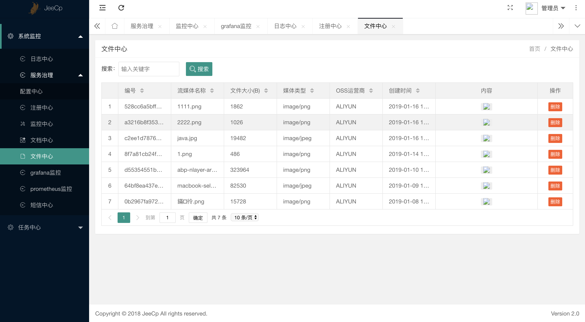

# Awesome Spring Cloud

公正、公平、尊重原创、不夹带私人恩怨的Spring Cloud学习资源。

> **TIPS**
>
> - 欢迎转载！
> - 欢迎投稿，共同完善！**一起打造最强的Spring Cloud学习资源帖！**

投稿方式（任选）：

- [GitHub](https://github.com/eacdy/awesome-spring-cloud)
- [Gitee](https://gitee.com/itmuch/awesome-spring-cloud)
- 加笔者微信 `jumping_me` 投稿

## 目录

* [博客](#博客)
* [示例代码](#示例代码)
* [开源项目](#开源项目)
* [中间件](#中间件)
* [网站资源](#网站资源)
* [其他](#其他)
* [交流](#交流)

## 一、博客

* 周立：[跟我学Spring Cloud](http://www.itmuch.com/spring-cloud/spring-cloud-index/)
* 程序猿DD：[Spring Cloud 从入门到精通](http://blog.didispace.com/spring-cloud-learning/)
* 江南一点雨：[Spring Cloud系列](https://wangsong.blog.csdn.net/column/info/17373)
* aoho：[Spring Cloud](http://blueskykong.com/tags/Spring-Cloud)
* 猿天地：[Spring Cloud入门到实战系列教程](http://cxytiandi.com/blog/detail/17470)
* 方志朋：[史上最简单的 Spring Cloud 教程](http://blog.csdn.net/column/details/15197.html)
* liaokailin：[Spring Cloud专栏](http://blog.csdn.net/liaokailin/article/category/6212338)
* 唐亚峰：[一起来学Spring Cloud（F版）](https://blog.battcn.com/categories/SpringCloud/)

## 二、示例代码

* 跟我学Spring Cloud配套代码：[spring-cloud-study](https://github.com/eacdy/spring-cloud-study)
* 最全面的Spring Cloud代码示例（70+个示例）：[Spring Cloud示例](https://github.com/itmuch/spring-cloud-docker-microservice-book-code)
* 程序猿DD Spring Cloud学习示例：[SpringCloud-Learning](https://github.com/dyc87112/SpringCloud-Learning)
* 史上最简单的Spring  Cloud教程源码：[SpringCloud Learning](https://github.com/forezp/SpringCloudLearning)
* 基于Spring Cloud Netflix的TCC柔性事务和EDA事件驱动示例：[spring-cloud-rest-tcc](https://github.com/prontera/spring-cloud-rest-tcc)

## 三、开源项目

### 3.1 Spring Cloud YES

**简介**：基于Spring Cloud的快速开发脚手架&最佳实践总结

**GitHub**：[Spring Cloud YES](http://www.github.com/eacdy/spring-cloud-yes)

**截图**：暂无

### 3.2 Cloud-Platform

**简介**：国内首个基于Spring Cloud微服务化开发平台

**Gitee**：[Cloud-Platform](https://gitee.com/minull/ace-security)

**截图**：

### 3.3 Spring Microservice Exam

**简介**：基于Spring Boot、Spring Cloud、Vue.js的考试系统

**Gitee**：[Spring Microservice Exam](https://gitee.com/wells2333/spring-microservice-exam)

**演示地址**：`http://182.254.233.125/` 

**截图**：

### 3.4 Piggymetrics

**简介**：基于Spring Cloud的个人财务处理软件，老牌Spring Cloud示例项目。

**GitHub**：[Piggymetrics](https://github.com/sqshq/piggymetrics)

**截图**：

### 3.5 FCat

**简介**：基于 Angular 4 + Spring Cloud 的企业级基础功能框架

**Gitee**：[FCat](https://gitee.com/xfdm/FCat)

**演示地址**：`http://fcat.xfdmao.com/` 用户名/密码：自行注册

**截图**：

### 3.6 OCP(Open Capacity Platform)

**简介**：基于LayUI + Spring Cloud的企业级微服务框架

**Gitee**：[Open Capacity Platform](https://gitee.com/owenwangwen/open-capacity-platform)

**演示地址**：`http://59.110.164.254:8066/login.html`  ，用户名/密码：admin/admin

**截图**：

### 3.7 XxPay

**简介**：XxPay聚合支付使用Java开发，包括spring-cloud、dubbo、spring-boot三个架构版本，已接入微信、支付宝等主流支付渠道，可直接用于生产环境。

**Gitee**：[XxPay](https://gitee.com/jmdhappy/xxpay-master)

**演示地址**：`http://mgr.xxpay.org/` ，用户名/密码：自动登录

**截图**：

## 四、中间件

> **注**：这里只罗列第三方中间件，不包含Spring Cloud原生支持的中间件。

### 4.1 ByteTCC

**简介**：兼容JTA规范的基于TCC机制的分布式事务管理器

**GitHub**：[ByteTCC](https://github.com/liuyangming/ByteTCC)

**与Spring Cloud配合使用示例**：[springcloud-sample](https://github.com/liuyangming/ByteTCC-sample/tree/master/springcloud-sample)

### 4.2 Alibaba Seata

**简介**：易上手、高性能的分布式解决方案

**GitHub**：[Alibaba Seata](https://github.com/seata/seata)

**与Spring Cloud配合使用示例**：[fescar-example](https://github.com/spring-cloud-incubator/spring-cloud-alibaba/tree/master/spring-cloud-alibaba-examples/fescar-example)

### 4.3 LCN

**简介**：高性能分布式事务框架

**GitHub**：[LCN](https://github.com/codingapi/tx-lcn)

**与Spring Cloud配合使用示例**：[txlcn-demo](https://github.com/codingapi/txlcn-demo)

### 4.4 EasyTransaction

**简介**：一站式SOA/微服务分布式事务解决方案

**GitHub**：[EasyTransaction](https://github.com/QNJR-GROUP/EasyTransaction)

**与Spring Cloud配合使用示例**：[easytrans-demo](https://github.com/QNJR-GROUP/EasyTransaction/tree/master/easytrans-demo/tcc-and-fescar)

## 五、网站资源

* [官方网站](https://spring.io/projects/spring-cloud)
* [官方文档](https://spring.io/projects/spring-cloud#learn)
* [Gitter.im](https://gitter.im/spring-cloud/spring-cloud)
  * Spring Cloud官方聊天室，很活跃，在里面可以提问
* [Spring4all社区](http://www.spring4all.com/)
  * 以Spring为中心的技术社区

## 其他

* 分布式锁：[基于Redis的分布式锁](http://www.itmuch.com/spring-boot/global-lock/)
* Awesome IDEA：[Awesome IDEA](https://github.com/eacdy/awesome-idea)

## 交流

关注 `IT牧场` ，回复 `Spring Cloud` 进群交流。

